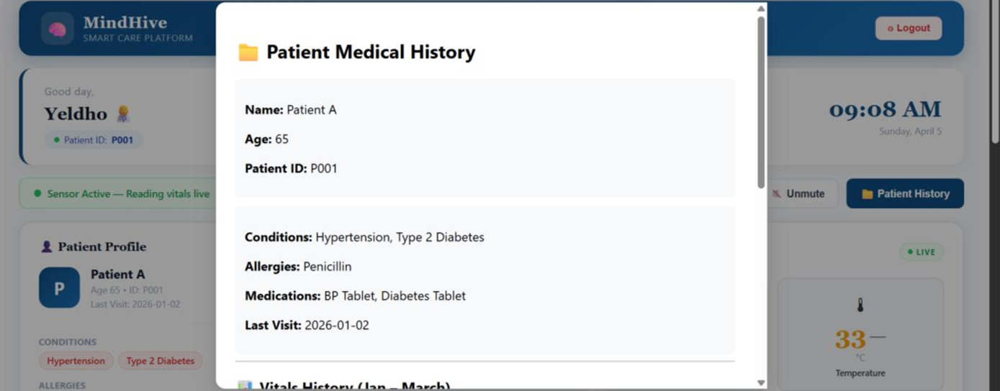

# MindHive 🧠

### An HCI-Based Smart Home Automation and Healthcare Monitoring System.

MindHive is an intelligent assistive healthcare platform designed to improve the independence, safety, and quality of life of individuals with severe mobility impairments. By integrating Human Computer Interaction (HCI), Internet of Things (IoT), cloud computing, and real-time health monitoring, the system enables users to control their environment through eye-blink interaction while providing caregivers with continuous access to vital health information.

The platform combines smart home automation, physiological monitoring, emergency alert management, and caregiver support into a unified ecosystem, reducing dependency on physical assistance and enabling proactive healthcare management.

## Overview

Paralyzed and mobility-impaired individuals often depend heavily on caregivers for routine activities such as controlling household appliances and monitoring health conditions.Existing solutions generally focus on either healthcare monitoring or home automation, resulting in fragmented user experiences.

MindHive addresses this challenge by providing a centralized platform that combines assistive control, real-time health monitoring, emergency alerts, and caregiver support into a single integrated solution.

## Key Features

### Human–Computer Interaction (HCI)

* Eye-blink-based appliance control
* Real-time blink detection using computer vision
* Accessible and user-friendly interaction model
* Enhanced independence for mobility-impaired users

### Smart Healthcare Monitoring

* Continuous Heart Rate Monitoring
* SpO₂ Monitoring
* Body Temperature Monitoring
* Historical health record tracking
* Real-time data visualization

### Intelligent Alert System

* Automated detection of abnormal vital readings
* Real-time emergency notifications
* Rapid caregiver intervention support
* Critical condition monitoring

### Caregiver Dashboard

* Live patient monitoring
* Health trend visualization
* Alert management
* Patient history tracking
* Appliance control interface

### Cloud Integration

* Secure cloud-based storage
* Real-time data synchronization
* Remote accessibility
* Reliable health data management

## System Architecture

MindHive follows a modular architecture consisting of:

* Patient Interaction Layer
* Eye Blink Detection Module
* Smart Home Automation Module
* Vitals Monitoring Module
* Emergency Alert Module
* Cloud Database Layer
* Authentication Layer
* Caregiver Dashboard Layer

The architecture ensures scalability, maintainability, and seamless integration of future healthcare and automation modules.

## Technology Stack

### Frontend

* React.js
* Vite
* HTML5
* CSS3
* JavaScript

### Backend

* Node.js
* Express.js
* REST APIs

### Database & Authentication

* Supabase
* PostgreSQL
* JWT Authentication

### Hardware Components

* ESP32 Microcontroller
* MAX30102 Sensor
* DS18B20 Temperature Sensor
* Relay Module

### Computer Vision & HCI

* OpenCV
* Dlib
* Eye Aspect Ratio (EAR) Algorithm

## Core Modules

### Authentication Module

Provides secure caregiver registration and login using Supabase Authentication.

### Eye Blink Detection Module

Detects voluntary eye blinks and converts them into appliance control commands.

### Smart Home Automation Module

Allows users to control electrical appliances such as lights and fans through assistive interaction.

### Real-Time Vitals Monitoring Module

Monitors heart rate, SpO₂, and body temperature continuously.

### Emergency Alert Module

Generates alerts when vital readings exceed predefined safety thresholds.

### Reminder Module

Provides medication and food reminders for effective patient care.

### Reports & Analytics Module

Maintains historical health records and visualizes patient health trends.

## 📸 Screenshots

### 🔐 Login

### 📝 Signup

### 🏠 Caregiver Dashboard

### ❤️ Live Patient Vitals

### 💊 Medication & Food Schedule

### 👤 Patient Profile

### 📈 Vitals Trend

## Research Contributions

* Integration of Human–Computer Interaction with IoT-enabled healthcare systems
* Eye-blink-based assistive control for mobility-impaired individuals
* Unified healthcare monitoring and home automation platform
* Real-time caregiver monitoring and emergency alert management
* Cloud-based health data management and accessibility

## Future Scope

* EMG-Based Assistive Control
* Voice-Controlled Automation
* AI-Based Health Risk Prediction
* Mobile Application Integration
* ECG and Blood Pressure Monitoring
* Smart Hospital Integration
* Advanced Remote Healthcare Services

